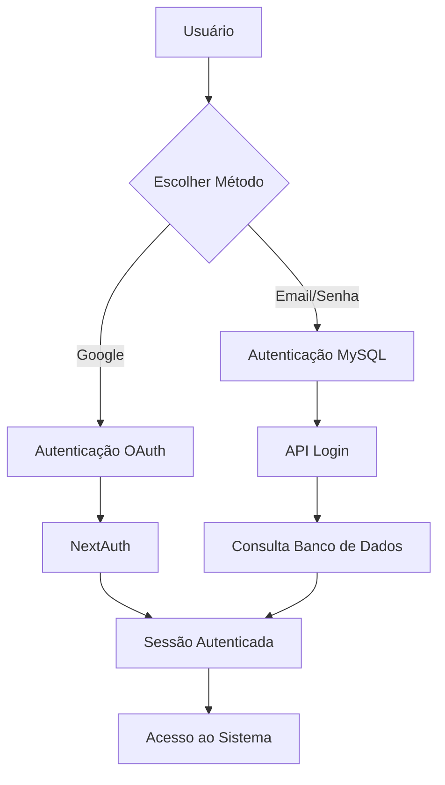
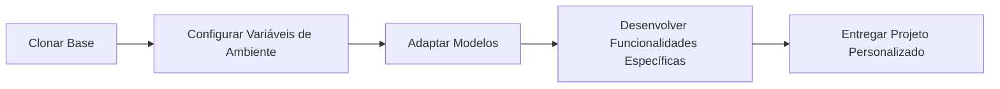

# Base Next.js EPAMIG

Este projeto serve como base para a criação de outros projetos da EPAMIG, já com autenticação Google e login com banco de dados MySQL configurados para demonstração.

## Características Principais

- **Autenticação Dual**: 
  - Login via Google OAuth
  - Login tradicional com banco de dados MySQL
- **Stack Tecnológica**:
  - Next.js 14
  - TypeScript
  - Tailwind CSS
  - MySQL
  - NextAuth.js
- **Estrutura pronta para uso**:
  - Componentes reutilizáveis
  - Layout responsivo
  - API Routes configuradas

## Fluxo de Autenticação



## Fluxo de Desenvolvimento



## Como Utilizar

1. Clone este repositório
2. Instale as dependências:
   ```bash
   npm install
   ```
3. Configure as variáveis de ambiente:
   ```
   DATABASE_HOST=seu_host
   DATABASE_PORT=3306
   DATABASE_USER=seu_usuario
   DATABASE_PASSWORD=sua_senha
   DATABASE_NAME=seu_banco
   
   GOOGLE_CLIENT_ID=seu_client_id
   GOOGLE_CLIENT_SECRET=seu_client_secret
   
   NEXTAUTH_URL=http://localhost:3000
   NEXTAUTH_SECRET=sua_chave_secreta
   ```
4. Execute o projeto em modo de desenvolvimento:
   ```bash
   npm run dev
   ```

## Estrutura do Banco de Dados

O sistema espera uma tabela de usuários com a seguinte estrutura mínima:

```sql
CREATE TABLE usuarios (
  id INT AUTO_INCREMENT PRIMARY KEY,
  nome VARCHAR(255) NOT NULL,
  email VARCHAR(255) NOT NULL UNIQUE,
  senha VARCHAR(255) NOT NULL
);
```

## Personalização

Este projeto base pode ser facilmente adaptado para necessidades específicas de cada aplicação, mantendo o sistema de autenticação já implementado e funcionando.

---

Desenvolvido como base de projetos para EPAMIG.
